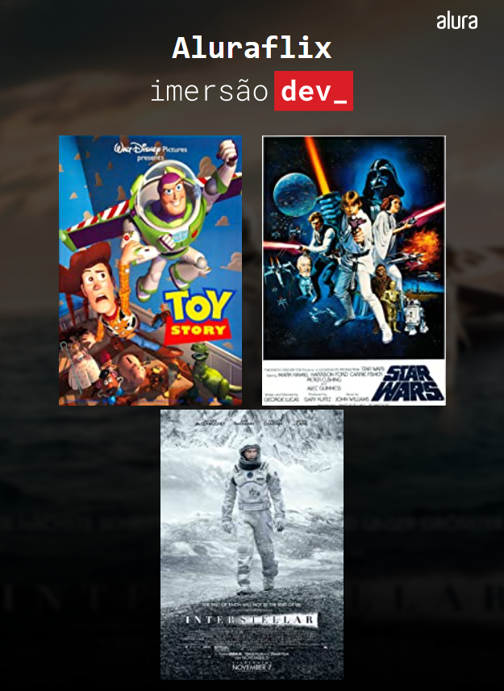

    
    
    
    
    

#### DESAFIOS AULA 01
- [ ] Criar um programa que converta libra em dólar, ou graus Celsius para Fahrenheit
- [ ] Exibir o resultado da conversão na tela, no lugar da função alert.

#### DESAFIOS AULA 02
- [ ] Exibir um pokemon na tela e pedir para o usuário escrever o nome desse pokemon. Exibir se acertou ou errou o nome.

#### DESAFIOS AULA 03
- [ ] Modifique o cenário do mentalista e adicione mecanismos de chances, pontos e etc!
- [ ] O comando break pode ser substituído para que o código saia do while sem ele. Você consegue pensar em uma alternativa?
- [ ] Alterar o math.random() para funcionar com outros intervalos entre números.

#### DESAFIOS AULA 04
- [ ] Criar uma array adicional com o nome dos filmes e trabalhar com as duas ao mesmo tempo, unindo imagens e textos através dos índices;
- [ ] Exibir um prompt() com uma lista de filmes e exibir na tela somente o filme escolhido pelo usuário através do prompt;
- [ ] Continuando o desafio acima, como fazer com que um filme só seja exibido uma vez?

#### DESAFIOS AULA 05
- [ ] Substituir o pôster de cada filme pelo trailer. Dica: pesquisem pela opção embed no menu de compartilhamento do YouTube;
- [ ] Estudar o innerHTML e a função que está criando a lista de pôsters. Como o código funciona para adicionar filmes sem utilizar array?
- [ ] Criar a função validaFilme() que faça somente a verificação que está sendo feita no if.

#### DESAFIOS AULA 06
- [ ] ---
 
#### DESAFIOS AULA 07
- [ ] ---

#### DESAFIOS AULA 08
- [ ] ---

#### DESAFIOS AULA 09
- [ ] ---
 
#### DESAFIOS AULA 10
- [ ] ---
